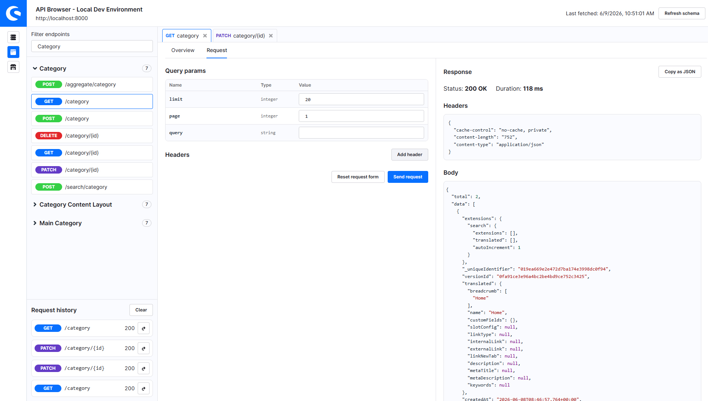

# Shopware API Browser

A lightweight, browser-first API client for Shopware 6. Manage multiple instances, discover endpoints from OpenAPI schemas, and send requests to the **Admin API** and **Store API** — with authentication handled for you and everything stored locally in your browser.



## Features

- Add, edit, and delete Shopware instances
- All configuration and secrets stay in local browser storage (IndexedDB)
- Browse endpoints grouped by tags with search/filter
- Open multiple endpoint tabs with persistent request drafts
- Automatic OAuth token acquisition, caching, and refresh
- JSON request editor, response viewer, and request history
- No backend required — runs entirely in the browser

## Requirements

- **Node.js** 18+ (for development and building)
- **Latest Chrome** (target browser for v1)
- A **Shopware 6** instance reachable from your machine

For OpenAPI schema endpoints, Shopware must expose `_info/openapi3.json` (typically when `APP_ENV=dev`, or with appropriate access in your setup).

## Getting started

```bash
# Install dependencies
npm install

# Start development server
npm run dev
```

Open the URL shown in the terminal (usually `http://localhost:5173`).

### Production build

```bash
npm run build
npm run preview
```

The static assets are written to `dist/`.

## Usage

### 1. Add an instance

On the dashboard, click **Add Instance** and provide:

| Field | Description |
| --- | --- |
| Display name | A label for your local list |
| Base URL | Shopware root URL, e.g. `https://shopware.local` or `http://localhost:8000` |
| Auth type | User credentials or integration credentials |

Credentials are used to authenticate against the Admin API (schema fetch, sales channel lookup, and Admin API requests).

### 2. Open a browser

Each instance card offers two primary actions:

- **Open API Browser** — Admin API (`/api/...`)
- **Open Store-API Browser** — Store API (`/store-api/...`)

Both browsers can be open at the same time. Use the sidebar icons to switch between them:

- Terminal icon — Admin API browser
- Storefront icon — Store API browser

### 3. Explore and send requests

1. Endpoints appear in the left sidebar after the schema loads (refresh manually if needed).
2. Click an endpoint to open it in a tab.
3. Fill path, query, header, and body parameters on the **Request** tab.
4. Click **Send** to execute the request and inspect status, headers, body, and timing.

For the **Store API browser**, pick a **sales channel** in the toolbar first. The app obtains a context token and sends the required Store API headers with every request.

### Secondary actions

- **Edit** — Update instance configuration
- **Test connection** — Verify reachability and schema access
- **Clear cached data** — Remove schema, tabs, tokens, and history for the instance (keeps the instance entry)
- **Delete** — Remove the instance and all related local data

## Development

```bash
npm run dev          # Vite dev server
npm run build        # Typecheck + production build
npm run preview      # Serve production build locally
npm run typecheck    # Vue/TS type checking
npm run lint         # ESLint
npm run lint:fix     # ESLint with auto-fix
npm run format       # Prettier
npm run test         # Vitest (single run)
npm run test:watch   # Vitest watch mode
```

### Tech stack

- [Vue 3](https://vuejs.org/) + [TypeScript](https://www.typescriptlang.org/)
- [Vite](https://vite.dev/)
- [Pinia](https://pinia.vuejs.org/) + [Vue Router](https://router.vuejs.org/)
- [Dexie](https://dexie.org/) (IndexedDB)
- [CodeMirror 6](https://codemirror.net/) for JSON editing
- [@shopware-ag/meteor-component-library](https://meteor.shopware.com/)

### Project layout

```
src/
├── components/          # UI components (endpoint workspace, editors)
├── domain/              # Shared TypeScript models
├── layouts/             # App shell and navigation
├── services/            # Auth, schema fetch, request execution
├── storage/             # IndexedDB repositories and migrations
├── stores/              # Pinia stores
├── utils/               # OpenAPI parsing, request drafts, helpers
└── views/               # Instance overview and API browser views
```
